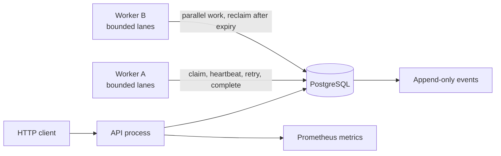

# RelayFlow

RelayFlow is a durable workflow execution engine that makes backend reliability tradeoffs concrete. It accepts workflows over HTTP, persists execution state in PostgreSQL, distributes ready steps across independent workers, renews time-bounded leases, and recovers work after worker failure.

[GitHub repository](https://github.com/sambalbalado/relayflow)


## Capabilities

- Durable workflow, step, attempt, lease, and event state in PostgreSQL
- Separate API and worker processes
- Multiple concurrent workers with explicit identities
- Atomic claims using `FOR UPDATE SKIP LOCKED`
- Time-bounded leases with periodic heartbeat renewal
- Concurrent-safe reclamation of expired work
- Fenced completion: a stale lease token cannot commit a result
- At-least-once execution with stable per-step operation keys
- Submission idempotency with conflict detection for mismatched payloads
- DAG validation with cycle, unknown-dependency, self-dependency, and duplicate rejection
- Dependency-aware release and parallel execution of independent branches
- Typed retry eligibility with bounded exponential backoff
- Per-step execution timeouts and durable workflow cancellation
- Fail-fast propagation that cancels work made irrelevant by a terminal failure
- Paginated, ordered execution-event queries
- Append-only execution events enforced by the database
- Structured JSON logs with workflow, step, attempt, worker, and operation identifiers
- Correlated HTTP access logs and request IDs
- Prometheus-compatible durable queue, workflow, retry, failure, timeout, lease, and latency metrics
- Configurable bounded concurrency within each worker process
- Dockerized load generator and reproducible before/after benchmark
- Reproducible worker-crash and recovery demonstration
- Bounded graceful shutdown that drains claimed work while renewing its lease
- Strict request, identifier, DAG, policy, and handler-input validation
- GitHub Actions CI and an isolated exported-checkout acceptance test
- Docker-based unit, static-analysis, integration, and concurrency checks

The built-in handlers are `echo`, `noop`, bounded `sleep`, deterministic `flaky` for retry demonstrations, and deterministic `fail` for failure-propagation demonstrations. RelayFlow executes allowlisted operations rather than arbitrary user code.

## Architecture

PostgreSQL is both the durable state store and the coordination boundary. This keeps state transitions, ownership changes, attempts, and audit events within one transactional system instead of introducing a separate broker before measurement justifies one.



See [docs/ARCHITECTURE.md](docs/ARCHITECTURE.md) for transaction boundaries, invariants, and failure semantics.

## Quick start

Requirements: Docker Desktop or Docker Engine with Compose, plus `curl`.

```sh
docker compose up --build -d
docker compose ps
./scripts/demo.sh
```

Inspect the correlated worker logs:

```sh
docker compose logs --no-color worker-a worker-b
```

Inspect Prometheus-format metrics:

```sh
curl --fail --silent http://localhost:8080/metrics
```

Stop the services while preserving the database:

```sh
docker compose down
```

Use a different host port without editing files:

```sh
HTTP_PORT=18080 POSTGRES_PORT=15432 docker compose up --build -d
RELAYFLOW_URL=http://localhost:18080 ./scripts/demo.sh
```

## API

Submit a workflow:

```sh
curl --fail --silent --show-error \
  -H 'Content-Type: application/json' \
  -d '{
    "idempotency_key": "readme-demo-1",
    "name": "branching example",
    "steps": [
      {"key": "prepare", "kind": "noop", "input": {}},
      {"key": "left", "kind": "echo", "input": {"branch": "left"}, "depends_on": ["prepare"]},
      {"key": "right", "kind": "echo", "input": {"branch": "right"}, "depends_on": ["prepare"]},
      {"key": "join", "kind": "noop", "input": {}, "depends_on": ["left", "right"]}
    ]
  }' \
  http://localhost:8080/v1/workflows
```

Query the returned workflow ID:

```sh
curl --fail --silent http://localhost:8080/v1/workflows/WORKFLOW_ID
```

Repeating an identical submission key returns the existing workflow. Reusing the key with a different definition returns `409 Conflict`. Health and database-aware readiness endpoints are `GET /healthz` and `GET /readyz`.

Query ordered events or cancel non-terminal work:

```sh
curl --fail --silent 'http://localhost:8080/v1/workflows/WORKFLOW_ID/events?after=0&limit=50'
curl --fail --silent -X POST http://localhost:8080/v1/workflows/WORKFLOW_ID/cancel
```

Each step may set `retry.max_attempts`, `retry.initial_backoff`, and `timeout`. Retry delays grow as `initial_backoff × 2^(attempt-1)` and are capped at one hour.

Submission bodies are limited to 1 MiB and must use `Content-Type: application/json`. Unknown fields, trailing JSON values, malformed UUID paths, unsafe identifiers, invalid handler inputs, cycles, and invalid retry/timeout policies are rejected before persistence.

## Failure-recovery demonstration

```sh
make crash-demo
```

The script starts two workers, lets `worker-a` claim a long-running step, kills that process with `SIGKILL`, starts `worker-b`, waits for lease expiry, and verifies:

- the workflow succeeds;
- attempt 1 is `lease_expired` and owned by `worker-a`;
- attempt 2 succeeds under `worker-b`;
- exactly one lease-expiry event is recorded.

Contrast that abrupt failure with graceful drain:

```sh
make graceful-shutdown-test
```

The worker receives `SIGTERM`, stops claiming, continues heartbeats, completes its owned step, commits attempt 1, and exits before the configured drain deadline.

## Verification

A host Go installation is not required.

```sh
make fmt-check
make vet
make test
make test-race
make test-store-integration
make test-integration
make crash-demo
make semantics-test
make observability-test
make graceful-shutdown-test
make index-review
make load
make benchmark
make clean-room-test
```

The store integration suite exercises simultaneous claimers, simultaneous reclaimers, heartbeat extension, attempt history, idempotency conflicts, cancellation transitions, and event pagination against real PostgreSQL. The semantics suite proves cycle rejection, parallel branching, retry exhaustion rules, timeout persistence, cancellation, failure propagation, and ordered event access. The observability suite verifies backlog growth and drain, durable metric deltas, readiness checks, and correlated logs. See [docs/PERFORMANCE.md](docs/PERFORMANCE.md) for benchmark methodology and results.

`make verify` runs the complete local quality and behavior suite. `make clean-room-test` copies only repository files into a temporary directory, starts an isolated Compose project on alternate ports, runs unit tests, and executes the documented demo. GitHub Actions independently runs formatting, vet, unit/race tests, real-PostgreSQL integration tests, Compose validation, and image builds.

## Configuration

| Setting | Default | Purpose |
|---|---:|---|
| `DATABASE_URL` | local Compose connection | PostgreSQL connection string |
| `HTTP_ADDRESS` | `:8080` | API listen address inside the container |
| `POLL_INTERVAL` | `250ms` | idle claim and reclamation cadence |
| `LEASE_DURATION` | `10s` | ownership period before reclamation eligibility |
| `HEARTBEAT_INTERVAL` | `3s` | lease-renewal cadence; must be shorter than the lease |
| `WORKER_ID` | hostname | durable attempt owner identity |
| `WORKER_CONCURRENCY` | `1` (`4` in Compose) | bounded execution lanes, 1–64 |
| `SHUTDOWN_TIMEOUT` | `15s` | maximum graceful drain window |
| `HTTP_PORT` | `8080` | Compose host API port |
| `POSTGRES_PORT` | `5432` | Compose host PostgreSQL port |

Copy `.env.example` to `.env` only when local overrides are useful. The checked-in database password is intentionally local-development-only.

## Execution semantics

RelayFlow provides **at-least-once execution**, not exactly-once external effects. A worker may complete an external side effect and die before recording success. Lease fencing prevents stale database commits; it cannot undo an external call. Each claimed step therefore receives a stable `operation_key` that an operation can use as a downstream idempotency key.

## Repository map

```text
cmd/api/                 HTTP process
cmd/worker/              worker process
cmd/loadgen/             concurrent workload generator
internal/api/            routing, validation, and response contract
internal/domain/         workflow and step models
internal/store/          PostgreSQL transactions and coordination
internal/worker/         execution, heartbeats, and handlers
internal/migrations/     ordered migration runner
internal/observability/  Prometheus exposition model
db/migrations/           versioned PostgreSQL schema
scripts/                 demo and failure-recovery checks
docs/                    architecture, decisions, status, and demo guide
```

## Documentation

- [Architecture](docs/ARCHITECTURE.md)
- [Architecture decisions](docs/DECISIONS.md)
- [Capability status](docs/PROGRESS.md)
- [Demonstration guide](docs/DEMO.md)
- [Performance results](docs/PERFORMANCE.md)
- [Security review](docs/SECURITY.md)
- [Database index review](docs/INDEX_REVIEW.md)
- [100× scale plan](docs/SCALE.md)
- [Interview discussion guide](docs/INTERVIEW.md)

## License

No license has been selected. Treat the repository as source-available for portfolio review.
