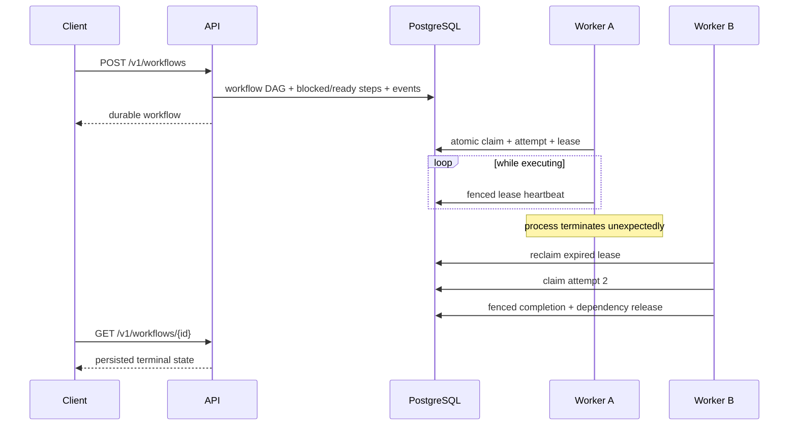
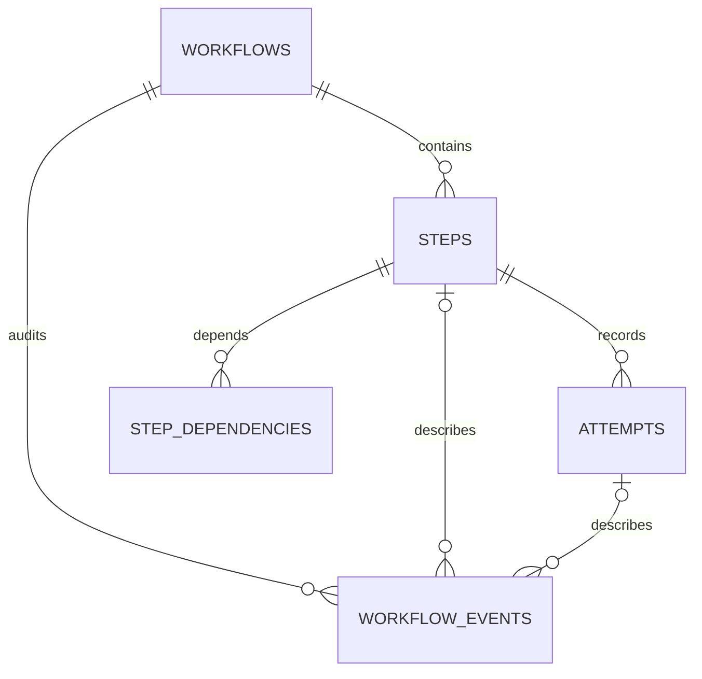

# RelayFlow architecture

## System boundary

RelayFlow orchestrates allowlisted operations; it does not execute arbitrary user code. The API persists definitions, workers execute ready steps, and PostgreSQL serializes ownership and state transitions. Every guarantee maps to a database predicate, transaction, and verification scenario.

## Data model

- `workflows` stores aggregate state, the submission idempotency key, and a canonical definition hash.
- `steps` stores handler input/output, retry and timeout policy, stable operation key, availability, owner, lease token, and expiry.
- `step_dependencies` provides the relation used by dependency scheduling.
- `attempts` records every ownership epoch, including lease expiration.
- `workflow_events` is append-only; a database trigger rejects update and delete.
- `schema_migrations` records ordered schema versions.

## Claim invariant

Claiming is a single transaction:

1. Select the oldest ready step with `FOR UPDATE SKIP LOCKED`.
2. Move it to `running`, assign worker identity, generate a fresh lease token, set expiry, and increment its attempt number.
3. Insert the matching attempt.
4. Move the parent workflow to `running` when necessary.
5. Append `step.claimed` and commit.

Only one transaction can own a selected row. Other workers skip the lock and look for different work instead of blocking behind it.

## Heartbeat and reclamation invariants

A heartbeat extends a lease only when all of these remain true:

- the step is `running`;
- the worker identity matches;
- the lease token matches;
- the lease has not already expired.

Expired work is reclaimed transactionally. Reclaimers lock candidates with `SKIP LOCKED`, mark the active attempt `lease_expired`, return the step to `ready`, clear ownership, and append `step.lease_expired`. Concurrent reclaimers cannot roll the same attempt over twice.

## Fenced completion

Completion and failure require the exact step ID and lease token and require the lease to remain unexpired. A worker that resumes after its ownership epoch ended cannot commit over the newer owner. Fencing protects RelayFlow's database state; it does not prevent a stale process from contacting an external system.

Completion transactions lock the parent workflow before deciding which dependencies are now satisfied. This serializes simultaneous sibling completions and prevents write skew: without that lock, each sibling could observe the other as unfinished and neither would release their shared child.

## DAG and dependency invariants

Submission validates all step keys and dependencies before opening the persistence transaction. Unknown, repeated, and self-dependencies are rejected, and depth-first traversal rejects cycles. Root steps begin `ready`; all other steps begin `blocked`.

After a successful completion, one transaction:

1. fences and marks the claimed step `succeeded`;
2. changes a blocked child to `ready` only when no dependency remains non-succeeded;
3. records each release event;
4. marks the workflow `succeeded` only when every step has succeeded.

Independent ready steps can be claimed by different workers. Dependency release is success-only; terminal failure uses the documented fail-fast rule.

## Retries, timeouts, and cancellation

Handlers classify failures as retryable or permanent. A worker-generated deadline is classified as a timeout. Retryable failures are returned to `ready` only while `attempt_no < max_attempts`; the next availability time uses capped exponential backoff. Every attempt remains durable with `failed`, `timed_out`, `lease_expired`, `cancelled`, or `succeeded` status.

A permanent failure or exhausted retry budget fails the workflow and cancels its blocked, ready, and concurrently running siblings. Cancellation follows the same durable shutdown of active steps and attempts but places the workflow in `cancelled`. Repeated cancellation is idempotent; cancellation of `succeeded` or `failed` workflows returns a conflict.

## Idempotency

Workflow submission keys are unique. Identical replay returns the existing workflow; reuse with a different name, step definition, handler, or JSON input returns `409 Conflict`.

Every step also has a stable `operation_key` derived from workflow ID and step key. Handlers can forward it to downstream systems as an idempotency key so repeated at-least-once attempts do not repeat the external effect.

## Transaction boundaries

- Submission atomically creates the workflow, DAG steps and dependencies, stable operation keys, policies, and initial events.
- Claim atomically changes ownership, creates an attempt, updates aggregate state, and appends an event.
- Reclamation atomically expires an attempt, releases the step, and records why.
- Completion atomically closes the step and attempt, releases newly eligible children, and conditionally closes the workflow.
- Failure atomically retries with backoff or fails the workflow and cancels remaining work.
- Cancellation atomically closes active attempts and steps and appends an audit event.
- HTTP success is returned only after submission commits.

## Reliability semantics

RelayFlow provides at-least-once execution. A worker can perform an external effect and die before committing success. Exactly-once effects require cooperation from the executed operation, typically through its own idempotency record or an inbox/outbox transaction.

PostgreSQL is the single source of truth. If an API or worker restarts, committed state remains. If PostgreSQL is unavailable, readiness fails and work does not progress through an unsafe fallback.

## Observability model

The API exposes `GET /metrics` in Prometheus text format. Queue and workflow gauges plus claim, retry, failure, timeout, cancellation, and lease-expiry counters are derived from durable PostgreSQL state and events. The execution-duration histogram is rebuilt from completed attempts. These values survive process restarts and can be reconciled directly with the audit tables.

API access logs include request ID, method, matched route, status, and duration. Worker logs include workflow, step, attempt, operation, worker, and execution-lane identifiers. Liveness proves the process can answer; readiness separately verifies database access.

Each worker process owns a bounded number of execution lanes configured by `WORKER_CONCURRENCY`. A dedicated per-process reclamation loop handles expired leases, avoiding one reclamation query per execution lane. Lanes immediately request more work after completion and wait for the poll interval only when the queue is empty.

## Graceful shutdown

`SIGINT` or `SIGTERM` first cancels the claim and reclamation loops, so the process cannot acquire new work. Already-claimed handlers continue on a separate execution context, keep renewing their leases, and persist completion or failure. The process waits up to `SHUTDOWN_TIMEOUT`; after that deadline it cancels the execution context and lets the lease/reclamation protocol recover unfinished work. `SIGKILL` cannot drain and is covered by the separate crash-recovery demonstration.

## Threat and failure model

| Failure or threat | Handling |
|---|---|
| Workers race for one step | Row lock, `SKIP LOCKED`, atomic state update |
| Multiple workers reclaim one expired step | Locked reclamation candidate and conditional attempt transition |
| Worker dies during execution | Time-bounded lease, heartbeat cessation, attempt rollover |
| Stale worker later finishes | Lease-token and expiry fencing reject completion |
| Worker dies after an external effect | Stable operation key enables downstream deduplication |
| Idempotency key is reused for different input | Definition comparison returns `409 Conflict` |
| Definition contains a cycle or invalid edge | Submission validation returns `422 Unprocessable Entity` |
| Sibling steps finish simultaneously | Workflow-row serialization prevents missed dependency release |
| Retryable operation repeatedly fails | Bounded attempt count and exponential backoff |
| Step exceeds its deadline | Execution context is cancelled and attempt persists as `timed_out` |
| Client cancels active work | Durable aggregate, step, and attempt cancellation prevents new claims |
| Malformed or oversized request | Strict JSON fields, validation, and 1 MiB body limit |
| Controlled worker termination | Stop new claims, renew and drain active work within a bounded deadline |
| Arbitrary code execution | Only registered handlers execute |
| Event-history tampering | Database trigger rejects updates and deletes |
| PostgreSQL outage | Readiness failure and no unsafe in-memory ownership fallback |

## Index intent

Partial indexes target ready-step claiming, expired-lease scans, finished attempts, and event-type counters. Event and attempt indexes support ordered history and metrics reconciliation. Metrics currently aggregate historical attempts at scrape time; event archival or pre-aggregation would be required at much larger history sizes.

The executable index review checks every expected index and proves the planner can select the three critical access paths when sequential scans are disabled to remove small-table plan noise. See [INDEX_REVIEW.md](INDEX_REVIEW.md).

## Growth path

At higher load, measure lock waits, ready-queue scan time, database CPU/WAL, heartbeat write volume, and connection pressure. Likely responses include batched claims, queue partitioning, adaptive heartbeat intervals, connection budgets, event archival, and read replicas for history. A separate broker is justified only if measured coordination pressure exceeds the database design's envelope.
